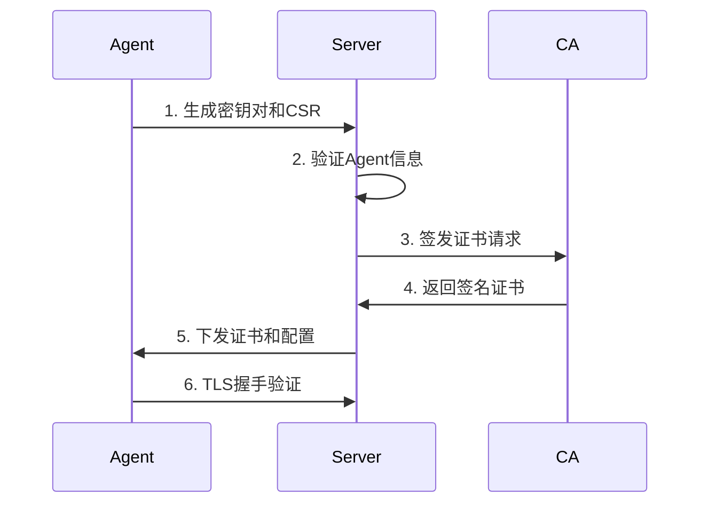

# OpenEDR 安全设计文档

## 1. 安全架构概述

### 1.1 安全原则

- **零信任架构**: 永不信任，始终验证
- **纵深防御**: 多层安全控制
- **最小权限**: 仅授予必要的访问权限
- **默认安全**: 安全配置作为默认选项
- **端到端加密**: 所有数据传输和存储加密
- **完整性保护**: 防止未授权的修改

### 1.2 威胁模型

#### 主要威胁
1. **未授权访问**: 攻击者试图获取系统访问权限
2. **数据泄露**: 敏感数据被窃取
3. **系统破坏**: 恶意修改或破坏系统
4. **拒绝服务**: 使系统无法正常运行
5. **内部威胁**: 恶意内部人员
6. **供应链攻击**: 通过第三方组件入侵

## 2. 身份认证与访问控制

### 2.1 Agent认证

#### 证书基础设施
```
根CA (离线存储)
  ├── 中间CA (HSM保护)
  │   ├── Server证书
  │   └── Agent证书
  └── 撤销列表(CRL)
```

#### Agent注册流程


#### 证书管理
- **生命周期**: 1年有效期，自动续期
- **撤销机制**: CRL + OCSP
- **密钥存储**: TPM/Secure Enclave (如可用)
- **备份恢复**: 加密备份密钥

### 2.2 用户认证

#### 多因素认证(MFA)
```yaml
authentication:
  methods:
    primary:
      - username_password
      - ldap
      - saml
    secondary:
      - totp
      - u2f
      - sms
      - email
  
  policies:
    password:
      min_length: 12
      complexity: true
      history: 5
      max_age_days: 90
    
    session:
      timeout_minutes: 30
      max_concurrent: 3
      ip_binding: true
```

#### 单点登录(SSO)
- SAML 2.0支持
- OAuth 2.0/OIDC集成
- LDAP/Active Directory
- Kerberos认证

### 2.3 授权模型

#### RBAC实现
```go
type Role struct {
    ID          string
    Name        string
    Permissions []Permission
}

type Permission struct {
    Resource string
    Actions  []string
}

// 预定义角色
var (
    AdminRole = Role{
        Name: "admin",
        Permissions: []Permission{
            {Resource: "*", Actions: []string{"*"}},
        },
    }
    
    AnalystRole = Role{
        Name: "analyst",
        Permissions: []Permission{
            {Resource: "events", Actions: []string{"read"}},
            {Resource: "alerts", Actions: []string{"read", "update"}},
            {Resource: "agents", Actions: []string{"read"}},
        },
    }
)
```

#### 属性基访问控制(ABAC)
```yaml
policies:
  - name: "restrict_sensitive_data"
    effect: "deny"
    conditions:
      - user.clearance_level < data.classification_level
      - user.department != data.owner_department
    
  - name: "time_based_access"
    effect: "allow"
    conditions:
      - current_time in user.work_hours
      - request.ip in company_network
```

## 3. 数据安全

### 3.1 传输安全

#### TLS配置
```nginx
# TLS 1.3 only
ssl_protocols TLSv1.3;

# 强密码套件
ssl_ciphers 'TLS_AES_256_GCM_SHA384:TLS_CHACHA20_POLY1305_SHA256';

# 其他安全头
ssl_prefer_server_ciphers off;
ssl_session_timeout 1d;
ssl_session_cache shared:SSL:10m;
ssl_session_tickets off;

# OCSP Stapling
ssl_stapling on;
ssl_stapling_verify on;
```

#### gRPC安全
```go
// 双向TLS配置
func NewSecureGRPCServer() *grpc.Server {
    cert, _ := tls.LoadX509KeyPair("server.crt", "server.key")
    ca, _ := ioutil.ReadFile("ca.crt")
    
    caCertPool := x509.NewCertPool()
    caCertPool.AppendCertsFromPEM(ca)
    
    tlsConfig := &tls.Config{
        Certificates: []tls.Certificate{cert},
        ClientAuth:   tls.RequireAndVerifyClientCert,
        ClientCAs:    caCertPool,
        MinVersion:   tls.VersionTLS13,
    }
    
    creds := credentials.NewTLS(tlsConfig)
    return grpc.NewServer(grpc.Creds(creds))
}
```

### 3.2 存储安全

#### 数据加密
```go
// AES-256-GCM加密
type EncryptionService struct {
    key []byte
}

func (s *EncryptionService) Encrypt(plaintext []byte) ([]byte, error) {
    block, _ := aes.NewCipher(s.key)
    gcm, _ := cipher.NewGCM(block)
    
    nonce := make([]byte, gcm.NonceSize())
    io.ReadFull(rand.Reader, nonce)
    
    ciphertext := gcm.Seal(nonce, nonce, plaintext, nil)
    return ciphertext, nil
}
```

#### 密钥管理
```yaml
key_management:
  provider: "vault"  # HashiCorp Vault
  
  hierarchy:
    master_key:
      storage: "hsm"
      rotation: "yearly"
    
    data_encryption_keys:
      derivation: "hkdf"
      rotation: "quarterly"
    
    session_keys:
      algorithm: "ephemeral"
      lifetime: "24h"
```

### 3.3 数据分类和处理

#### 数据分类
| 级别 | 类型 | 加密要求 | 访问控制 |
|------|------|----------|-----------|
| 机密 | 密码、密钥 | AES-256 + HSM | 仅管理员 |
| 敏感 | PII、日志 | AES-256 | 基于角色 |
| 内部 | 配置、规则 | AES-128 | 认证用户 |
| 公开 | 文档、指标 | 可选 | 所有用户 |

#### 数据脱敏
```go
// PII数据脱敏
func MaskPII(data map[string]interface{}) {
    patterns := map[string]string{
        "email":    `(\w{2})\w+@(\w+\.\w+)`,
        "ip":       `(\d+\.\d+\.)\d+\.\d+`,
        "username": `(\w{2})\w+`,
    }
    
    for field, pattern := range patterns {
        if val, ok := data[field].(string); ok {
            data[field] = regexp.MustCompile(pattern).
                ReplaceAllString(val, "${1}***@${2}")
        }
    }
}
```

## 4. 应用安全

### 4.1 安全编码实践

#### 输入验证
```go
// 严格的输入验证
func ValidateAgentID(id string) error {
    if len(id) != 36 {
        return errors.New("invalid agent ID length")
    }
    
    if !regexp.MustCompile(`^[a-f0-9-]+$`).MatchString(id) {
        return errors.New("invalid agent ID format")
    }
    
    return nil
}

// SQL注入防护
func GetAgent(db *sql.DB, id string) (*Agent, error) {
    if err := ValidateAgentID(id); err != nil {
        return nil, err
    }
    
    query := `SELECT * FROM agents WHERE id = $1`
    return db.QueryRow(query, id).Scan(...)
}
```

#### 输出编码
```typescript
// XSS防护
function sanitizeOutput(data: any): string {
    const encoder = document.createElement('div');
    encoder.textContent = String(data);
    return encoder.innerHTML;
}

// Content Security Policy
const cspHeader = {
    'Content-Security-Policy': 
        "default-src 'self'; " +
        "script-src 'self' 'unsafe-inline'; " +
        "style-src 'self' 'unsafe-inline'; " +
        "img-src 'self' data:; " +
        "connect-src 'self' wss://;"
};
```

### 4.2 API安全

#### 速率限制
```go
// Token Bucket算法
type RateLimiter struct {
    rate     int
    bucket   int
    tokens   int
    lastTime time.Time
    mu       sync.Mutex
}

func (rl *RateLimiter) Allow() bool {
    rl.mu.Lock()
    defer rl.mu.Unlock()
    
    now := time.Now()
    elapsed := now.Sub(rl.lastTime).Seconds()
    rl.tokens += int(elapsed * float64(rl.rate))
    
    if rl.tokens > rl.bucket {
        rl.tokens = rl.bucket
    }
    
    if rl.tokens < 1 {
        return false
    }
    
    rl.tokens--
    rl.lastTime = now
    return true
}
```

#### API认证
```go
// JWT中间件
func JWTMiddleware(secret []byte) gin.HandlerFunc {
    return func(c *gin.Context) {
        token := c.GetHeader("Authorization")
        if token == "" {
            c.AbortWithStatusJSON(401, gin.H{"error": "missing token"})
            return
        }
        
        claims, err := ValidateJWT(token, secret)
        if err != nil {
            c.AbortWithStatusJSON(401, gin.H{"error": "invalid token"})
            return
        }
        
        c.Set("user", claims.Subject)
        c.Next()
    }
}
```

## 5. 基础设施安全

### 5.1 容器安全

#### Dockerfile安全
```dockerfile
# 使用特定版本的基础镜像
FROM alpine:3.18.4

# 创建非root用户
RUN addgroup -g 1000 -S openedr && \
    adduser -u 1000 -S openedr -G openedr

# 安装必要的包并清理
RUN apk add --no-cache ca-certificates && \
    rm -rf /var/cache/apk/*

# 复制文件并设置权限
COPY --chown=openedr:openedr agent /usr/local/bin/
RUN chmod 550 /usr/local/bin/agent

# 切换到非root用户
USER openedr

# 只读文件系统
RUN chmod -R 444 /etc/*

ENTRYPOINT ["/usr/local/bin/agent"]
```

#### Kubernetes安全
```yaml
apiVersion: v1
kind: Pod
metadata:
  name: openedr-agent
spec:
  securityContext:
    runAsNonRoot: true
    runAsUser: 1000
    fsGroup: 1000
  
  containers:
  - name: agent
    image: openedr/agent:latest
    securityContext:
      allowPrivilegeEscalation: false
      readOnlyRootFilesystem: true
      capabilities:
        drop:
        - ALL
        add:
        - NET_RAW  # 仅必要权限
    
    resources:
      limits:
        memory: "200Mi"
        cpu: "100m"
    
    volumeMounts:
    - name: tmp
      mountPath: /tmp
      readOnly: false
  
  volumes:
  - name: tmp
    emptyDir: {}
```

### 5.2 网络安全

#### 网络隔离
```yaml
# NetworkPolicy
apiVersion: networking.k8s.io/v1
kind: NetworkPolicy
metadata:
  name: openedr-network-policy
spec:
  podSelector:
    matchLabels:
      app: openedr
  
  policyTypes:
  - Ingress
  - Egress
  
  ingress:
  - from:
    - podSelector:
        matchLabels:
          app: openedr-server
    ports:
    - protocol: TCP
      port: 9090
  
  egress:
  - to:
    - podSelector:
        matchLabels:
          app: openedr-server
    ports:
    - protocol: TCP
      port: 443
```

#### 防火墙规则
```bash
# iptables规则示例
# 只允许必要的端口
iptables -A INPUT -p tcp --dport 443 -j ACCEPT
iptables -A INPUT -p tcp --dport 9090 -j ACCEPT
iptables -A INPUT -m state --state ESTABLISHED,RELATED -j ACCEPT
iptables -A INPUT -j DROP

# 限制连接速率
iptables -A INPUT -p tcp --dport 443 -m limit --limit 100/minute --limit-burst 200 -j ACCEPT
```

## 6. 安全监控和响应

### 6.1 安全监控

#### 审计日志
```go
type AuditLogger struct {
    logger *zap.Logger
}

func (a *AuditLogger) LogSecurityEvent(event SecurityEvent) {
    a.logger.Info("security_event",
        zap.String("type", event.Type),
        zap.String("user", event.User),
        zap.String("action", event.Action),
        zap.String("resource", event.Resource),
        zap.Bool("success", event.Success),
        zap.String("ip", event.SourceIP),
        zap.Time("timestamp", event.Timestamp),
    )
}

// 安全事件类型
const (
    EventAuthFailure    = "auth_failure"
    EventUnauthorized   = "unauthorized_access"
    EventConfigChange   = "config_change"
    EventAnomalous      = "anomalous_behavior"
)
```

#### 实时告警
```yaml
alerts:
  - name: "multiple_auth_failures"
    condition: "count(auth_failure) > 5 in 5m"
    severity: "high"
    actions:
      - notify: ["security-team@company.com"]
      - block_ip: true
  
  - name: "privilege_escalation"
    condition: "user.role changed to admin"
    severity: "critical"
    actions:
      - notify: ["security-team@company.com"]
      - require_mfa: true
```

### 6.2 事件响应

#### 自动响应
```go
type SecurityResponseEngine struct {
    actions map[string]ResponseAction
}

func (e *SecurityResponseEngine) HandleThreat(threat Threat) {
    switch threat.Severity {
    case Critical:
        e.IsolateSystem(threat.Source)
        e.NotifySOC(threat)
        e.CollectForensics(threat)
    
    case High:
        e.BlockConnection(threat.Source)
        e.NotifyAnalyst(threat)
    
    case Medium:
        e.LogAndMonitor(threat)
    }
}
```

#### 取证收集
```bash
#!/bin/bash
# 自动取证脚本

# 收集系统信息
date > forensics.log
hostname >> forensics.log
uname -a >> forensics.log

# 收集网络连接
netstat -antp >> forensics.log
ss -antp >> forensics.log

# 收集进程信息
ps auxf >> forensics.log
lsof -n >> forensics.log

# 收集内存信息
cat /proc/meminfo >> forensics.log

# 打包加密
tar czf - forensics.log | \
  openssl enc -aes-256-cbc -salt -out forensics.tar.gz.enc
```

## 7. 合规性和隐私

### 7.1 数据隐私

#### GDPR合规
```go
// 数据主体权利实现
type PrivacyService struct {
    db *sql.DB
}

// 数据访问权
func (s *PrivacyService) ExportUserData(userID string) ([]byte, error) {
    // 收集所有用户相关数据
    data := make(map[string]interface{})
    
    // 从各个表收集数据
    queries := []string{
        "SELECT * FROM users WHERE id = $1",
        "SELECT * FROM events WHERE user_id = $1",
        "SELECT * FROM logs WHERE user_id = $1",
    }
    
    for _, query := range queries {
        // 执行查询并添加到data
    }
    
    return json.Marshal(data)
}

// 删除权
func (s *PrivacyService) DeleteUserData(userID string) error {
    tx, _ := s.db.Begin()
    defer tx.Rollback()
    
    // 删除或匿名化数据
    queries := []string{
        "DELETE FROM events WHERE user_id = $1",
        "UPDATE logs SET user_id = 'anonymous' WHERE user_id = $1",
        "DELETE FROM users WHERE id = $1",
    }
    
    for _, query := range queries {
        if _, err := tx.Exec(query, userID); err != nil {
            return err
        }
    }
    
    return tx.Commit()
}
```

### 7.2 合规报告

#### 自动化合规检查
```yaml
compliance_checks:
  pci_dss:
    - id: "10.1"
      description: "Audit trails linking access to cardholder data"
      query: |
        SELECT count(*) FROM audit_logs 
        WHERE resource LIKE '%cardholder%' 
        AND timestamp > NOW() - INTERVAL '90 days'
    
    - id: "8.2.3"
      description: "Passwords must meet complexity requirements"
      check: "password_policy.complexity == true"
  
  hipaa:
    - id: "164.312(a)(1)"
      description: "Access control"
      check: "rbac.enabled == true"
```

## 8. 安全测试

### 8.1 渗透测试

#### 测试范围
- Web应用安全测试
- API安全测试
- 基础设施安全测试
- 社会工程学测试

#### 测试工具
```bash
# OWASP ZAP扫描
zap-cli quick-scan --self-contained \
  https://openedr.example.com

# Nmap端口扫描
nmap -sS -sV -O -p- openedr.example.com

# SQLMap测试
sqlmap -u "https://api.openedr.com/agents?id=1" \
  --headers="Authorization: Bearer TOKEN"
```

### 8.2 安全代码审查

#### 静态分析
```yaml
# SonarQube配置
sonar.projectKey=openedr
sonar.sources=.
sonar.exclusions=**/*_test.go,**/vendor/**
sonar.go.coverage.reportPaths=coverage.out

# 安全规则
sonar.security.hotspots.maxIssues=0
sonar.security.rating=A
```

## 9. 灾难恢复

### 9.1 备份策略

#### 自动备份
```bash
#!/bin/bash
# 数据库备份脚本

# 备份PostgreSQL
pg_dump -h localhost -U openedr -d openedr_db | \
  gzip | \
  openssl enc -aes-256-cbc -salt -out backup-$(date +%Y%m%d).sql.gz.enc

# 备份Elasticsearch
elasticdump \
  --input=http://localhost:9200/openedr \
  --output=backup-$(date +%Y%m%d).json \
  --type=data

# 上传到安全存储
aws s3 cp backup-*.* s3://openedr-backups/ \
  --storage-class GLACIER
```

### 9.2 恢复流程

#### RTO和RPO目标
- **RTO (恢复时间目标)**: < 4小时
- **RPO (恢复点目标)**: < 1小时

## 10. 安全更新和补丁管理

### 10.1 漏洞管理

#### 依赖扫描
```yaml
# GitHub Actions workflow
name: Security Scan
on: [push, pull_request]

jobs:
  security:
    runs-on: ubuntu-latest
    steps:
    - uses: actions/checkout@v2
    
    - name: Run Snyk
      uses: snyk/actions/golang@master
      env:
        SNYK_TOKEN: ${{ secrets.SNYK_TOKEN }}
    
    - name: Run Trivy
      uses: aquasecurity/trivy-action@master
      with:
        scan-type: 'fs'
        scan-ref: '.'
```

### 10.2 补丁管理

#### 自动更新机制
```go
// Agent自动更新
type UpdateManager struct {
    currentVersion string
    updateURL      string
}

func (u *UpdateManager) CheckAndUpdate() error {
    latest, err := u.getLatestVersion()
    if err != nil {
        return err
    }
    
    if u.needsUpdate(latest) {
        return u.downloadAndInstall(latest)
    }
    
    return nil
}
```

## 结论

本安全设计文档为OpenEDR系统提供了全面的安全架构和实施指南。通过遵循这些安全原则和最佳实践，我们可以构建一个强大、可靠和安全的EDR解决方案。安全是一个持续的过程，需要定期审查和更新这些措施以应对新的威胁。 